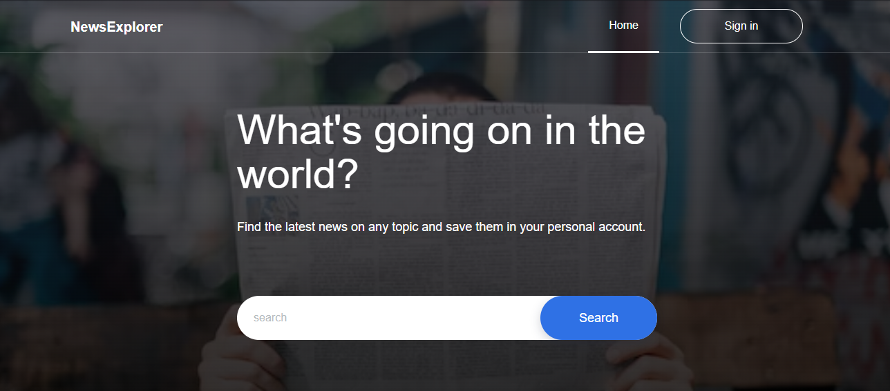

<h1 align="center"> News Explorer 🌏</h1>

<h4 align="center"> Welcome to News Explorer! This is a web application that allows users to search for and save news articles from around the web. </h4>
<br/>
<p align="center"> Backend - https://github.com/AhnafAhamed/news-explorer-backend</p> <br/>



## 🎯Featues
- Search for news articles on a variety of topics
- Save your favorite articles for later reference
- Create an account to save your articles and access them from any device

## ⚒️ Technologies
- React
- TypeScript
- JavaScript
- CSS
- News Api (To fetch news)

---

## 👟 Getting Started

**1. Clone the repository to your local machine:**

```
$ git clone https://github.com/AhnafAhamed/news-explorer-frontend.git
```

**2. Navigate to the root directory of the project and install the necessary dependencies:**

```
$ cd news-explorer-frontend
$ npm i
```

**3. Run the development server:**

```
$ npm run start
```

## ✨ Contributing

If you are interested in contributing to the development of News Explorer, please fork the repository and submit a pull request with your proposed changes.


